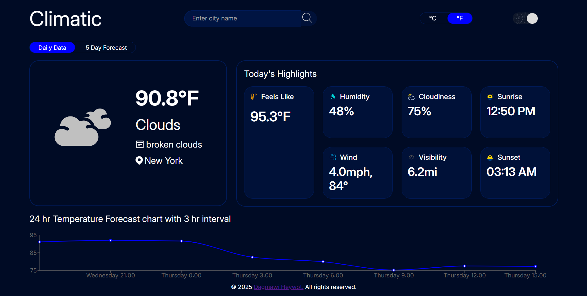

# 🌤️ Climatic
**Live Demo**: [climatic-dagi.vercel.app](https://climatic-dagi.vercel.app/)

**Climatic** is a clean, responsive weather web app built with a modern frontend stack. It fetches real-time weather data and provides a detailed, user-friendly forecast interface.

## 🚀 Features

- 📍 **Auto-Detect Location**  
  On first load, Climatic requests the user's browser location to show local weather data instantly.

- 🔍 **City-Based Search**  
  Users can search for weather in any city by typing the name and pressing **Enter** or clicking the **Search Icon**.

- 🌡️ **Current Weather Overview**
  - Temperature (°C/°F toggle)
  - Feels like
  - Humidity
  - Cloudiness
  - Wind speed
  - Visibility
  - Sunrise & Sunset times

- 🕒 **24-Hour Forecast**
  - Line chart with 3-hour intervals
  - Shows average temperature across the day

- 📅 **5-Day Forecast Tab**
  - Daily forecast cards with average temperature
  - Includes an additional graph showing temperature in 6-hour intervals

- 🎨 **Custom Weather Icons**
  - Hand-crafted SVG icons for various weather conditions

- 📱 **Mobile Responsive**
  - Fully optimized for all screen sizes

- 🌙 **Dark/Light Mode**
  - Toggle between light and dark themes
  - User preference saved in local storage

- 🌡️ **Temperature Unit Toggle**
  - Easily switch between Celsius and Fahrenheit
  - User preference also saved in local storage

## 🛠️ Technologies Used

- React.js  
- CSS (flexbox, grid, media queries)  
- Browser Geolocation API  
- Weather API (OpenWeather)  
- LocalStorage for persisting user preferences

## 📸 Preview



## 🧠 Usage

1. Clone the repository:
   ```bash
   git clone https://github.com/DagiH22/Climatic.git
   cd climatic
    ```
2. Install Dependencies:
    ```bash
    npm install
    ```
3. Run development server
    ```bash
    npm run dev
    ```
## 🔒 Permissions
Requires user permission to access location for auto-detection.